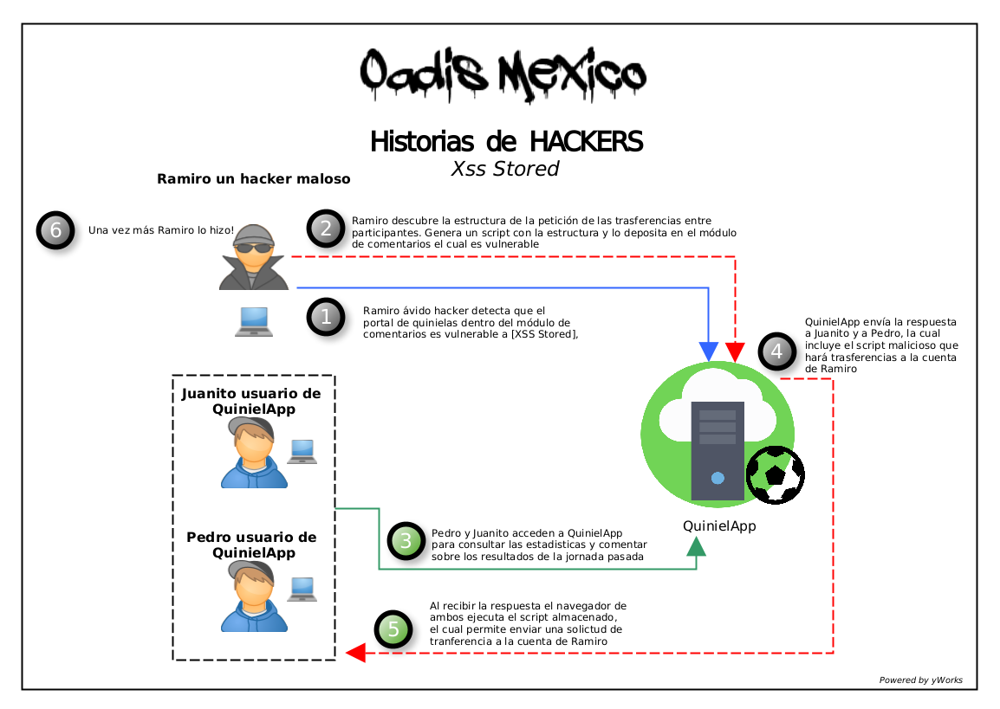

# Xss Stored                

## ¿Que es Xss Stored?

<div style="text-align: justify"> 
En una entrada anterior hablamos sobre la vulnerabilidad Xss Reflected, la cual representa una de las variantes de XSS, preguntarán ¿porque retomo este tema? si estamos hablando de Xss Stored, bueno, pues la razón es porque durante la definición de Xss reflected inicialmente conceptualizamos de forma general que es Xss, y en dicho artículo mencionamos lo siguiente:</div>

<br>

>Xss es una vulnerabilidad presente comúnmente en aplicaciones web la cual permitirá inyectar al (OUTPUT) ó a la salida de datos de la aplicación sentencias maliciosas que se reflejan o se ejecutan en el navegador de la víctima, las cuales aprovechando la confianza de la sesión que se ejecuta en el momento permitirá realizar acciones que pueden comprometer al usuario afectado.

<br>

<div style="text-align: justify"> 
Teniendo en mente la definición anterior, vamos a entender cómo funciona Xss Stored y cómo podemos diferenciarla entre Reflected y Dom(Ya sé, esto es nuevo, lo veremos en la próxima entrada).
Ya con la mente clara, podemos decir que en esta variante el aplicativo vulnerable es capáz de recibir datos proporcionados por el usuario, aquellos datos son guardados dentro del almacén de datos utilizado por el aplicativo, podría ser una base de datos, un archivo, etc.. Estos datos pueden incluir sentencias o scripts maliciosos los cuales al ser invocados por el aplicativo para mostrarlos a los usuarios se ejecutan y se muestran como parte del código de la aplicación. La posibilidad de almacenar estas sentencias maliciosas dentro del aplicativo permite que todos aquellos usuarios que consulten el módulo vulnerable sean afectados por estas sentencias.</div>

<br>

<div style="text-align: justify"> 
Dicho lo anterior deducimos lo siguiente:
En un ataque de Xss stored el atacante no necesariamente requiere inducir a los usuarios legítimos para que ejecuten la carga útil o las sentencias maliciosas, tal es el caso de Xss reflected, sino que el atacante deposita aquellas sentencias en el módulo del aplicativo vulnerable y todos aquellos usuarios que accedan a este apartado serán afectados una vez que la página cargue en su navegador.
 
Veamos un ejemplo más claro sobre esta vulnerabilidad.
Supongamos que nuestro ya conocido "Juanito" es un arduo jugador de quinielas. Al organizador de estas quinielas se le ocurre la maravillosa idea de realizar un portal para que puedan participar en estas de manera más flexible, se le ocurre que en este los participantes puedan hacer sus pagos, hacer transferencias entre participantes, guardar los datos de sus tarjetas para que sea menos tedioso participar en una nueva quiniela, ingresar sus estadísticas y comentar con los participantes sobre los resultados. Juanito muy emocionado no duda en registrarse y no conforme con eso ingresa los datos de su tarjeta. Dentro de este portal también está registrado nuestro maleante Ramiro, quien hábilmente detecta que el apartado de comentarios es vulnerable a Xss Stored, no conforme con esto obtiene la estructura de la petición para hacer transferencias hacia otros participantes y PUM hace un script el cual deposita dentro del apartado de comentarios el cual es vulnerable, ¡si como lo imaginaron! cada que un participante consulta el apartado de comentarios Ramiro obtiene una aportación a su cuenta gracias a esta vulnerabilidad.
Pero como siempre decimos, una imagen vale más que mil palabras.</div>

<br>
<font size="2">La imagen siguiente muestra un ejemplo de explotación de esta vulnerabilidad</font> 



## Conceptualización de la vulnerabilidad en código.

*Se muestra un ejemplo del código que muestra los comentarios de QuinielApp el cual es vulnerable a Xss Stored.*

```java
1 // Pseudocde for show all comments in QuinielApp
2 <table>
3     <c:forEach var="comment" items="${comments}">
4         <tr>
5             <td>${comment.userName}</td>
6             <td>${comment.title}</td>
7             <td>${comment.content}</td>
8         </tr>
9     </c:forEach>
10 </table>
```

<br>
<div style="text-align: justify"> 

1. Para representar todos los comentarios dentro de la etiqueta "table" se itera sobre los ítems del total de comentarios almacenados dentro del aplicativo. Para esto se invoca a la función "forEach". Línea 3
 
2. Posteriormente cada objeto de los comentarios es representado dentro de las etiquetas "td", aquí se anexa:
- "Username" de quien realizó el comentario. Línea 5
- "Título" asignado a cada comentario. Línea 6 
- "Contenido" de cada uno de los comentarios. Línea 7
 
3. Desafortunadamente para los usuarios de QuinielApp como podemos percibir en el ejemplo anterior el programador al enviar los datos que serán mostrados en el navegador no escapa de caracteres especiales, lo cual permite que se ejecute el código malicioso el cual será representado en el navegador cada uno de los usuarios.</div>

## Impacto de esta vulnerabilidad.

*La tabla siguiente muestra el impacto que puede ocasionar esta vulnerabilidad tomando como referencia la triada de seguridad.*

<table style="text-align:center; float:center;">
<thead>
<tr>
  <th bgcolor="007892" style="color:#f7f7f7;">Impacto-Vulnerabilidad</th>
  <th bgcolor="007892" style="color:#f7f7f7;">Confidencialidad</th>
  <th bgcolor="007892" style="color:#f7f7f7;">Integridad</th>
  <th bgcolor="007892" style="color:#f7f7f7;">Disponibilidad</th>
</tr>
</thead>
<tbody>
<tr>
  <td bgcolor="7d5a5a" style="color:#f7f7f7;" align="left">Lectura de datos</td>
  <td bgcolor="d8345f" style="color:#f7f7f7;">Aplica</td>
  <td></td>
  <td></td>
</tr>
<tr>
  <td bgcolor="7d5a5a" style="color:#f7f7f7;" align="left">Obtención de privilegios</td>
  <td bgcolor="d8345f" style="color:#f7f7f7;">Aplica</td>
  <td></td>
  <td></td>
</tr>
<tr>
  <td bgcolor="7d5a5a" style="color:#f7f7f7;" align="left">Ejecución no autorizada de comandos</td>
  <td bgcolor="d8345f" style="color:#f7f7f7;">Aplica</td>
  <td bgcolor="d8345f" style="color:#f7f7f7;">Aplica</td>
  <td bgcolor="d8345f" style="color:#f7f7f7;">Aplica</td>
</tr>
<tr>
  <td bgcolor="7d5a5a" style="color:#f7f7f7;" align="left">Modificación de datos</td>
  <td></td>
  <td bgcolor="d8345f" style="color:#f7f7f7;">Aplica</td>
  <td></td>
</tr>
</tbody>
</table>

<br>

## Conceptualización de la remediación de la vulnerabilidad en código.

<br>

```java
1 // Pseudocde for show all comments in QuinielApp
2 <table>
3     <c:forEach var="comment" items="${comments}">
4         <tr>
5             <td> <c:out value"${comment.userName}"/> </td>
6             <td> <c:out value"${comment.title}"/>    </td>
7             <td> <c:out value"${comment.content}"/>  </td>
8         </tr>
9     </c:forEach>
10 </table>
```
<div style="text-align: justify"> 
Para realizar la remediación adecuada a esta vulnerabilidad dentro del ejemplo presentado anteriormente vamos a hacer uso del tag "c:out" en las líneas 5,6,7, esta etiqueta nos ayudará a controlar los datos proporcionados por los usuarios ya que escapará y codificará de manera automática los caracteres HTML dentro del marcado mostrado al usuario, incluidos los caracteres "<" ">" ",", por lo cual esto evitará la inyección de código malicioso. 
</div>

## ¿Que elementos puedo utilizar para reforzar la seguridad ante esta vulnerabilidad o en el momento en que este desarrollando una nueva aplicación?

<div style="text-align: justify">
1. Uso del atributo HTTPOnly en las cookies.
  Este indicador evita que código JS acceda al contenido de la cookie, lo cual evita que las cookies sean obtenidas a través de la explotación de esta vulnerabilidad.
<br>
<br>
2. Uso del encabezado de respuesta http Content-Security-Policy.
  Este funciona baja el principio de white list, este encabezado restringe las fuentes desde las cuales se pueden cargar scripts y datos en todo sitio web, si un código malicioso se introduce en el código HTML sin ser reconocido dentro de la whitelist y este intenta cargar datos externos, el navegador del usuario lo rechazará.
<br>
<br>
3. Uso del encabezado HTTP X-XSS-Protection.
  Este encabezado evita que los navegadores carguen una página si detectan la explotación de Reflected XSS.
<br>
<br>
4. Uso de encabezados de respuesta apropiados.
  Establecer la cabecera X-Content-Type-Options nos apoyará en asegurar que los navegadores  no carguen hojas de estilo, JavaScript o un Myme-type no definido o inadecuado. Esto reduce el riesgo de un ataque de Xss o de confusión de Myme-type.
<br>
<br>
5. Tener la certeza de que cualquier verificación o validación de datos se realice del lado del servidor.
  Este aspecto es muy importante, ya que comúnmente(y lo digo por experiencia) suelen realizarse unas validaciones excelentes del lado del cliente, sin embargo cuando pasamos a evadir estas y nos centramos en el lado del servidor la vulnerabilidad suele estar ahí presente. Comúnmente en estos casos suelo sugerir que  las validaciones se realicen en los dos entornos.
<br>
<br>
6. Uso de Frameworks modernos.
  Muchos de los frameworks de desarrollo modernos suelen integrar soluciones para evitar este tipo de vulnerabilidades, esto suele ser de gran ayuda. Sin embargo, a mi parecer y experiencia como analista de seguridad algunos de estos tienen integradas vulnerabilidades dentro del código. Por tal sugiero se realice un análisis previo para tomar la mejor decisión al optar por uno de estos.
</div>

### Proximas actividades por incluír dentro de este artículo.

<div>

<p>
- Desarrollo de aplicación dummie vulnerable a xss stored.
<br>
- Riesgos y vulnerabilidades que pueden derivar de la explotación de esta vulnerabilidad.
<br>
- Walkthrough para explotación de vulnerabilidad.
<br>
- Intrusion test para validar que la solución de remediación propuesta es adecuada.
</p>
<h4>Referencias</h4>
<p>
https://cwe.mitre.org/data/definitions/79.html<br>
https://capec.mitre.org/data/definitions/592.html<br>
https://owasp.org/www-community/attacks/xss/<br>
https://cheatsheetseries.owasp.org/cheatsheets/Cross_Site_Scripting_Prevention_Cheat_Sheet.html<br>
</p>
</div>

